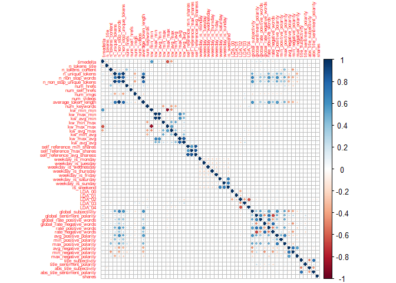
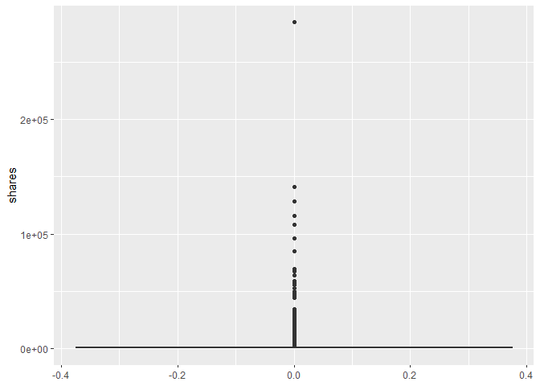
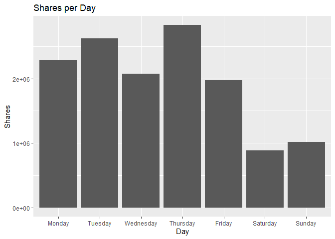
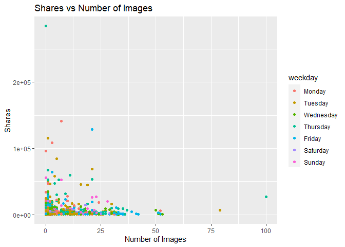
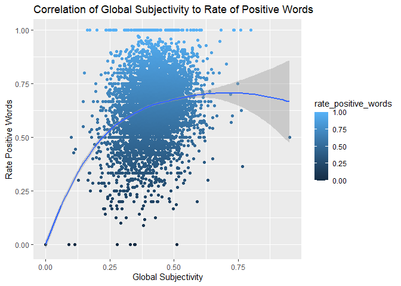
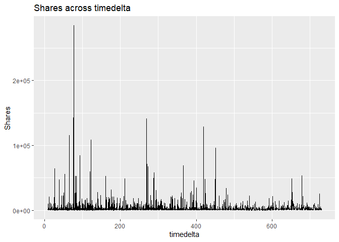

Project 2
================
Group 6, Xavier Genelin, Dave Bergeron
10/19/2021

I don’t think we need all of these libraries. We can keep them for now
but the project doesn’t require anything with SQL so those can be
removed later.

Dave: Agree, one of my bad habits not pruning the list from one
assignment to the other.

# Introduction

We’ll load in the (Online News Popularity Data
Set)\[<https://archive.ics.uci.edu/ml/datasets/Online+News+Popularity>\]
from the UCI Machine Learning Repository. From this data, we’ll break it
down into 6 different groups based on the data channel: lifestyle,
entertainment, bus, socmed, tech, and world.

Libraries that are being used:

-   `tidyverse`  
-   `caret`

# Load Data w/Automation

``` r
# load in the data
news <- read_csv("OnlineNewsPopularity.csv")

#### this will be part of the overall parameters but we can change this as we go forward for different datasets
channel <- "world"

# create a new column for the data channel
news <- news %>% 
 mutate(data_channel = 
          if_else(data_channel_is_lifestyle == 1, "lifestyle", 
                  if_else(data_channel_is_entertainment == 1, "entertainment", 
                          if_else(data_channel_is_bus == 1, "bus", 
                                  if_else(data_channel_is_socmed == 1, "socmed", 
                                          if_else(data_channel_is_tech == 1, "tech", 
                                                  if_else(data_channel_is_world == 1, "world", "other")))))),
        weekday = if_else(weekday_is_monday == 1, "Monday", 
                          if_else(weekday_is_tuesday == 1, "Tuesday",
                                  if_else(weekday_is_wednesday == 1, "Wednesday",
                                          if_else(weekday_is_thursday == 1, "Thursday",
                                                  if_else(weekday_is_friday == 1, "Friday",
                                                          if_else(weekday_is_saturday == 1, "Saturday", "Sunday"))))))
        )

# Filter the news data set on the channel of interest
# remove the url and data_channel_is_* and weekday_is_* columns
news <- news %>% filter(data_channel == channel) %>% select(!c(url, starts_with("data_channel"), starts_with("weekday_is")))

news$weekday <- factor(news$weekday, levels = c("Monday", "Tuesday", "Wednesday", "Thursday", "Friday", "Saturday", "Sunday"))

# set seed for reproducibility
set.seed(55)

# create a list of indicies for the training set
trainIndex <- createDataPartition(news$shares, p = 0.7, list = FALSE)

# make training and test sets
newsTrain <- news[trainIndex, ]
newsTest <- news[-trainIndex, ]
```

# Summarizations

I was hoping to see the correlation plot for the variables to see what
was most related to shares. Kind of rough with the large number of
variables

``` r
corrs <- cor(worldTrain)

corrplot(corrs, tl.cex = 0.5)
```

<!-- -->

# EDA items

## Graphs

### Graph 1

``` r
ggplot(data = newsTrain, aes(x = newsTrain$num_keywords, y = newsTrain$num_imgs)) + geom_point(aes(color = newsTrain$shares), position = "jitter") + labs(x = "Keywords", y = "Number of Images", title="Images to Keywords ")
```

<!-- -->

### Graph 2

``` r
# xavier. Not the best but I'll try and make it be a little more detailed
ggplot(data = newsTrain, aes(x = ordered(weekday, levels = c("Monday", "Tuesday", "Wednesday", "Thursday", "Friday", "Saturday", "Sunday")), y = shares)) + 
  geom_col() + 
  labs(title = "Shares per Day", x = "Day", y = "Shares")
```

<!-- -->

### Graph 3

``` r
# xavier
ggplot(newsTrain, aes(x = num_imgs, y = shares)) +
  geom_point(aes(color = weekday)) +
  labs(title = "Shares vs Number of Images", x = "Number of Images", y = "Shares")
```

<!-- --> \#\#\# Graph
4

``` r
ggplot(data = newsTrain, aes(y = rate_positive_words, x = global_subjectivity)) + geom_point(aes(color = rate_positive_words), position = "jitter") + geom_smooth(formula = y ~ x, method = "loess") + labs(x = "Global Subjectivity", y = "Rate Positive Words", title="Correlation of Global Subjectivity to Rate of Positive Words")
```

<!-- -->

### Graph 5

``` r
ggplot(newsTrain, aes(x=timedelta)) + 
  geom_line(aes(y=shares))+ labs(title="Shares across timedelta",
       y="Shares")
```

<!-- -->

### Graph 6

## Contingency Tables

### 2-way Contingency Table

Showing counts of keywords that appear on the weekend vs. not on the
weekend.

``` r
table(newsTrain$num_keywords, newsTrain$is_weekend)
```

    ##     
    ##        0   1
    ##   2    1   0
    ##   3   65  21
    ##   4  274  49
    ##   5  594  95
    ##   6  947 136
    ##   7  970 109
    ##   8  755 111
    ##   9  628  81
    ##   10 915 149

### 3-Way Contingency Table

I need to figure out what a kw\_min\_min means, but it works for the
three way table given the fixed number of categories.

``` r
table(newsTrain$num_keywords, newsTrain$is_weekend, newsTrain$kw_min_min)
```

    ## , ,  = -1
    ## 
    ##     
    ##        0   1
    ##   2    1   0
    ##   3   58  19
    ##   4  224  40
    ##   5  485  81
    ##   6  721 117
    ##   7  680  87
    ##   8  510  82
    ##   9  391  50
    ##   10 599 111
    ## 
    ## , ,  = 0
    ## 
    ##     
    ##        0   1
    ##   2    0   0
    ##   3    0   0
    ##   4    0   0
    ##   5    1   0
    ##   6    3   0
    ##   7    2   0
    ##   8    1   0
    ##   9    0   0
    ##   10   0   0
    ## 
    ## , ,  = 4
    ## 
    ##     
    ##        0   1
    ##   2    0   0
    ##   3    4   2
    ##   4   28   6
    ##   5   62   8
    ##   6  140  14
    ##   7  205  17
    ##   8  175  22
    ##   9  203  27
    ##   10 262  33
    ## 
    ## , ,  = 42
    ## 
    ##     
    ##        0   1
    ##   2    0   0
    ##   3    0   0
    ##   4    0   0
    ##   5    0   0
    ##   6    0   0
    ##   7    0   0
    ##   8    0   0
    ##   9    0   0
    ##   10   1   0
    ## 
    ## , ,  = 201
    ## 
    ##     
    ##        0   1
    ##   2    0   0
    ##   3    0   0
    ##   4    0   0
    ##   5    0   0
    ##   6    0   0
    ##   7    0   0
    ##   8    0   0
    ##   9    0   0
    ##   10   1   0
    ## 
    ## , ,  = 217
    ## 
    ##     
    ##        0   1
    ##   2    0   0
    ##   3    3   0
    ##   4   22   3
    ##   5   46   6
    ##   6   83   5
    ##   7   83   5
    ##   8   69   7
    ##   9   34   4
    ##   10  52   5

## Numerical Summary

``` r
newsTrain %>% group_by(weekday) %>% summarise(Min = min(shares), Mean = mean(shares), Max = max(shares), SD = sd(shares))
```

    ##   Min     Mean    Max
    ## 1  35 2320.473 284700
    ##         SD
    ## 1 6604.997

# Modeling

In this section we’re going to compare the following models: random
forest, linear regression, and two ensemble models (we can fill this in
when we decide which two to do). Each of the models will be trying to
predict the amount of shares for each of the data channels.

## Random Forest

Tried to use all the variables, took forever to run. Initially had 10 cv
and 1:15 trees. Made the cv to 5 and tried smaller mtry values but it
still takes a long time.

``` r
set.seed(55)
now <- Sys.time()
# takes forever to run
rfFit <- train(shares ~ num_imgs + kw_avg_avg + LDA_00 + LDA_01 + LDA_02 + LDA_03 + LDA_04, data = newsTrain, method = "rf", preProcess = c("center", "scale"), trControl = trainControl(method = "cv", number = 5), tuneGrid = expand.grid(mtry = 1:8))

rfFit$results
```

    ##   mtry     RMSE   Rsquared
    ## 1    1 6235.807 0.02872809
    ## 2    2 6293.147 0.02482341
    ## 3    3 6332.355 0.02439606
    ## 4    4 6385.028 0.02031078
    ## 5    5 6400.657 0.02026119
    ## 6    6 6412.317 0.01919049
    ## 7    7 6449.269 0.01717049
    ## 8    8 6459.236 0.01599669
    ##        MAE   RMSESD
    ## 1 2002.454 2291.600
    ## 2 2060.813 2277.021
    ## 3 2092.077 2273.134
    ## 4 2113.805 2250.159
    ## 5 2113.894 2236.533
    ## 6 2118.534 2257.166
    ## 7 2126.605 2228.338
    ## 8 2130.360 2229.223
    ##   RsquaredSD    MAESD
    ## 1 0.02012784 136.5958
    ## 2 0.01836717 135.8031
    ## 3 0.02052901 139.8363
    ## 4 0.01694072 135.1955
    ## 5 0.01727338 134.2730
    ## 6 0.01459433 138.2099
    ## 7 0.01308157 136.4320
    ## 8 0.01251889 130.1594

``` r
# took 14 minutes
Sys.time() - now
```

    ## Time difference of 11.60309 mins

## Linear Regression

``` r
#Model 1 -  Selecting predictors based on relevancy from ANOVA results after running the summary from model using all predictors in another model - 4 predictors
worldtrainglmfit <- lm(shares ~ num_imgs + kw_min_avg + kw_max_avg + kw_avg_avg, data = newsTrain, trControl = trainControl(method = "cv", number = 10), preProcess = c("center", "scale"))

pred1 <- predict(worldtrainglmfit, newdata = newsTest)

postResample(pred1, obs = newsTest$shares)[2]
```

    ##   Rsquared 
    ## 0.02334528

``` r
# Xavier model
olsFit <- train(shares ~  num_imgs + kw_avg_avg + LDA_02 + LDA_03 + average_token_length + rate_negative_words, data = newsTrain, method = "lm", preProcess = c("center", "scale"), trControl = trainControl(method = "cv", number = 10))

olsPred <- predict(olsFit, newsTest)

postResample(olsPred, obs = newsTest$shares)[2]
```

    ##   Rsquared 
    ## 0.03088937

``` r
# poisson model
poissonFit <- train(shares ~ num_imgs + kw_avg_avg + LDA_02 + LDA_03 + average_token_length + rate_negative_words, data = newsTrain, method = "glm", family = "poisson", preProcess = c("center", "scale"), trControl = trainControl(method = "cv", number = 10))

poissonPred <- predict(poissonFit, newsTest)

postResample(poissonPred, obs = newsTest$shares)[2]
```

    ##   Rsquared 
    ## 0.03021605

Not much of a difference between the linear model and poisson

## Ensemble

### Boosted Tree

This is the boosted tree model using all predictors in the `newsTrain`
data set.

``` r
set.seed(30)
wtFit <- train(shares ~ num_imgs + kw_avg_avg + LDA_02 + LDA_03 + average_token_length + rate_negative_words, data = newsTrain,
               method = "gbm",
               preProcess = c("center", "scale"),
               trControl = trainControl(method = "cv",
                                        number = 5),
               tuneGrid = expand.grid(.n.trees = seq(25, 200, by = 25), .interaction.depth = seq(1, 4, by = 1), .shrinkage = (0.1), .n.minobsinnode = (10)))
```

    ## Iter   TrainDeviance   ValidDeviance   StepSize   Improve
    ##      1 50880149.2349             nan     0.1000 138291.3616
    ##      2 50681984.7164             nan     0.1000 -4232.2056
    ##      3 50553862.2811             nan     0.1000 31053.1210
    ##      4 50428101.9957             nan     0.1000 -28049.7052
    ##      5 50330125.8353             nan     0.1000 56340.1558
    ##      6 50197870.6693             nan     0.1000 24525.4517
    ##      7 50173479.1812             nan     0.1000 -19107.2741
    ##      8 50100913.8496             nan     0.1000 49232.1182
    ##      9 50032515.5421             nan     0.1000 -60168.2329
    ##     10 49981013.3862             nan     0.1000 -52625.0447
    ##     20 49485030.3880             nan     0.1000 3439.7802
    ##     40 48870049.1885             nan     0.1000 -63818.0319
    ##     60 48393869.5484             nan     0.1000 22689.6984
    ##     80 47981306.4935             nan     0.1000 -23401.6675
    ##    100 47517134.8163             nan     0.1000 -1926.2000
    ##    120 47129395.8372             nan     0.1000 -52661.8664
    ##    140 46756023.8105             nan     0.1000  796.6511
    ##    160 46547679.6578             nan     0.1000 -55578.5005
    ##    180 46334451.1998             nan     0.1000 -43360.7580
    ##    200 46032403.4772             nan     0.1000 -28070.9359
    ## 
    ## Iter   TrainDeviance   ValidDeviance   StepSize   Improve
    ##      1 50970779.1742             nan     0.1000 131603.5115
    ##      2 50558072.0893             nan     0.1000 108376.3024
    ##      3 50409816.5980             nan     0.1000 158342.8316
    ##      4 50183130.6136             nan     0.1000 64151.7052
    ##      5 49778320.6238             nan     0.1000 -72454.3951
    ##      6 49645401.1772             nan     0.1000 63856.3229
    ##      7 49348755.0288             nan     0.1000 32910.6144
    ##      8 49257080.3664             nan     0.1000 18604.6463
    ##      9 49002652.7555             nan     0.1000 -153127.9420
    ##     10 48834378.2998             nan     0.1000 -6769.1511
    ##     20 47263540.7642             nan     0.1000 8833.6366
    ##     40 44782921.0154             nan     0.1000 -91838.9488
    ##     60 43359618.0207             nan     0.1000 -55132.5042
    ##     80 42058500.3747             nan     0.1000 -90106.3304
    ##    100 40675340.9911             nan     0.1000 -58997.6389
    ##    120 39524913.4980             nan     0.1000 -185606.8448
    ##    140 38877023.9824             nan     0.1000 -83854.2506
    ##    160 38192881.4979             nan     0.1000 -57750.1799
    ##    180 37400070.5293             nan     0.1000 -3337.2102
    ##    200 36432453.2227             nan     0.1000 -50612.2992
    ## 
    ## Iter   TrainDeviance   ValidDeviance   StepSize   Improve
    ##      1 50748480.1926             nan     0.1000 -1829.6139
    ##      2 50497548.0971             nan     0.1000 219561.0509
    ##      3 50294505.2017             nan     0.1000 95380.4479
    ##      4 50116321.2737             nan     0.1000 93042.2467
    ##      5 49634813.7670             nan     0.1000 20440.2939
    ##      6 49150123.3764             nan     0.1000 108104.0414
    ##      7 48776105.1267             nan     0.1000 -62271.3232
    ##      8 48348926.5237             nan     0.1000 -300541.3659
    ##      9 47975623.1388             nan     0.1000 -10136.6153
    ##     10 47737568.8422             nan     0.1000 -25020.0148
    ##     20 46547146.8611             nan     0.1000 -97326.1614
    ##     40 44262001.5837             nan     0.1000 -233614.3114
    ##     60 42458215.1115             nan     0.1000 -160491.8685
    ##     80 40935416.9019             nan     0.1000 -188184.1796
    ##    100 39290162.7403             nan     0.1000 -64199.2990
    ##    120 38122670.6798             nan     0.1000 -34668.7441
    ##    140 36557906.6967             nan     0.1000 -113291.0647
    ##    160 35404994.1441             nan     0.1000 -65870.1235
    ##    180 34430196.0846             nan     0.1000 -51446.8400
    ##    200 33483589.3609             nan     0.1000 -85285.6905
    ## 
    ## Iter   TrainDeviance   ValidDeviance   StepSize   Improve
    ##      1 50624962.3793             nan     0.1000 -63278.4501
    ##      2 50451736.3956             nan     0.1000 30321.9485
    ##      3 50211698.6690             nan     0.1000 99544.9439
    ##      4 49683685.9653             nan     0.1000 211504.3640
    ##      5 49127262.6805             nan     0.1000 70768.2463
    ##      6 48622437.2831             nan     0.1000 51839.6105
    ##      7 48301977.4913             nan     0.1000 1333.5940
    ##      8 47850659.1439             nan     0.1000 -256949.1070
    ##      9 47766465.4784             nan     0.1000 10688.2581
    ##     10 47636102.2047             nan     0.1000 -6459.3328
    ##     20 44962015.4729             nan     0.1000 -12699.3460
    ##     40 42356061.6065             nan     0.1000 -116723.0844
    ##     60 40157369.8992             nan     0.1000 -136877.6379
    ##     80 38282345.6969             nan     0.1000 -77523.7470
    ##    100 36594630.5123             nan     0.1000 -178511.0573
    ##    120 35401478.9462             nan     0.1000 -163678.4426
    ##    140 33984088.5872             nan     0.1000 -75545.8192
    ##    160 32950630.9569             nan     0.1000 -29758.1084
    ##    180 32036676.2334             nan     0.1000 -111105.8060
    ##    200 30860203.4543             nan     0.1000 -40833.3965
    ## 
    ## Iter   TrainDeviance   ValidDeviance   StepSize   Improve
    ##      1 48827105.6930             nan     0.1000 6232.3436
    ##      2 48586580.1556             nan     0.1000 47223.3300
    ##      3 48429353.1099             nan     0.1000 7168.8945
    ##      4 48358746.7066             nan     0.1000 54776.1033
    ##      5 48264393.2696             nan     0.1000 3263.5169
    ##      6 48149329.0653             nan     0.1000 59699.3827
    ##      7 48074226.1378             nan     0.1000 24691.4309
    ##      8 47979276.3687             nan     0.1000 -75204.9941
    ##      9 47908156.9944             nan     0.1000 -101048.6586
    ##     10 47825044.7922             nan     0.1000 7660.8535
    ##     20 47378617.7089             nan     0.1000 17977.0577
    ##     40 46835178.2137             nan     0.1000 7252.8770
    ##     60 46331375.9582             nan     0.1000 39649.1703
    ##     80 45939949.1948             nan     0.1000 -97190.4297
    ##    100 45510133.5823             nan     0.1000 -71650.3229
    ##    120 45218469.5764             nan     0.1000 -74196.6852
    ##    140 45079112.9008             nan     0.1000 -66107.1553
    ##    160 44912695.7744             nan     0.1000 9577.9952
    ##    180 44705446.1149             nan     0.1000 -88883.2301
    ##    200 44489338.5625             nan     0.1000 4147.5805
    ## 
    ## Iter   TrainDeviance   ValidDeviance   StepSize   Improve
    ##      1 48698649.6387             nan     0.1000 85621.4292
    ##      2 48226753.7616             nan     0.1000 -69193.6541
    ##      3 48143209.4889             nan     0.1000 27053.5727
    ##      4 48072204.6287             nan     0.1000 41916.2836
    ##      5 47594547.8046             nan     0.1000 111828.9624
    ##      6 47310297.5646             nan     0.1000 -16928.7445
    ##      7 47217568.9495             nan     0.1000 43724.6457
    ##      8 47072785.1008             nan     0.1000 69771.4391
    ##      9 46758704.6027             nan     0.1000 -11238.1094
    ##     10 46656964.0947             nan     0.1000 35234.3908
    ##     20 45429651.1418             nan     0.1000 -166398.8124
    ##     40 43767696.3759             nan     0.1000 -154549.6040
    ##     60 42592944.5691             nan     0.1000 -226117.2908
    ##     80 41101970.2159             nan     0.1000 -66076.9905
    ##    100 39870951.6859             nan     0.1000 -87442.2940
    ##    120 38933674.6088             nan     0.1000 -37371.9447
    ##    140 38334764.1499             nan     0.1000 -77699.6325
    ##    160 37453208.7238             nan     0.1000 -138373.9666
    ##    180 36620824.8892             nan     0.1000 -42612.5022
    ##    200 35730148.1516             nan     0.1000 -9309.3680
    ## 
    ## Iter   TrainDeviance   ValidDeviance   StepSize   Improve
    ##      1 48332559.8838             nan     0.1000 256404.1341
    ##      2 48162280.7660             nan     0.1000 55851.7832
    ##      3 47630945.3769             nan     0.1000 125749.3769
    ##      4 47143116.2522             nan     0.1000 33426.8140
    ##      5 47065487.3489             nan     0.1000 12344.8841
    ##      6 46815439.8903             nan     0.1000 -31900.1776
    ##      7 46454783.4925             nan     0.1000 36282.3301
    ##      8 45983157.7095             nan     0.1000 -4890.6780
    ##      9 45724105.3761             nan     0.1000 -193466.6059
    ##     10 45596117.3754             nan     0.1000 42892.4637
    ##     20 43635415.3124             nan     0.1000 -129761.9283
    ##     40 41280974.2883             nan     0.1000 -62994.5904
    ##     60 39827204.7236             nan     0.1000 -39362.5006
    ##     80 38503132.3169             nan     0.1000 -70080.7070
    ##    100 37104183.8445             nan     0.1000 -162953.5195
    ##    120 35549542.3141             nan     0.1000 -159591.0369
    ##    140 34694123.6181             nan     0.1000 -32745.3489
    ##    160 33894708.2319             nan     0.1000 -122715.7392
    ##    180 32821436.7059             nan     0.1000 -37776.7339
    ##    200 31836357.8617             nan     0.1000 -37181.7075
    ## 
    ## Iter   TrainDeviance   ValidDeviance   StepSize   Improve
    ##      1 48639301.4869             nan     0.1000 19924.2270
    ##      2 48016793.0689             nan     0.1000 49161.5840
    ##      3 47788947.5059             nan     0.1000 108557.6772
    ##      4 47229825.7767             nan     0.1000 71991.4660
    ##      5 46868314.7022             nan     0.1000 82668.7251
    ##      6 46650284.3278             nan     0.1000 37849.8016
    ##      7 45867150.4183             nan     0.1000 -49587.7867
    ##      8 45490472.2667             nan     0.1000 -160338.7075
    ##      9 45079050.0844             nan     0.1000 -211412.1493
    ##     10 45027849.1772             nan     0.1000 -85629.0868
    ##     20 43693943.5949             nan     0.1000 -280601.3434
    ##     40 41640443.8241             nan     0.1000 -219472.9704
    ##     60 39388015.1827             nan     0.1000 -187168.4150
    ##     80 37624254.3756             nan     0.1000 -127269.7315
    ##    100 35871996.0624             nan     0.1000 -117816.1484
    ##    120 34410284.1475             nan     0.1000 -110856.6480
    ##    140 33250540.3646             nan     0.1000 -108363.3664
    ##    160 31542371.5691             nan     0.1000 -40437.1870
    ##    180 30447664.2590             nan     0.1000 -48664.8154
    ##    200 29343438.2194             nan     0.1000 -27133.2415
    ## 
    ## Iter   TrainDeviance   ValidDeviance   StepSize   Improve
    ##      1 28938548.8946             nan     0.1000 46492.0978
    ##      2 28816696.3699             nan     0.1000 40472.8491
    ##      3 28751691.6855             nan     0.1000 65234.2103
    ##      4 28684189.7715             nan     0.1000 21748.4476
    ##      5 28649172.1260             nan     0.1000 6530.6030
    ##      6 28575788.1024             nan     0.1000 9115.5936
    ##      7 28504406.7864             nan     0.1000 -7924.3293
    ##      8 28432538.9206             nan     0.1000 13271.9305
    ##      9 28387442.3626             nan     0.1000 33559.3762
    ##     10 28333059.4825             nan     0.1000 5793.8694
    ##     20 27995192.4295             nan     0.1000 10201.3039
    ##     40 27777577.8126             nan     0.1000 -26594.2666
    ##     60 27633378.0280             nan     0.1000 -4395.8744
    ##     80 27521341.1474             nan     0.1000 -7601.7701
    ##    100 27398382.7018             nan     0.1000 -11701.7951
    ##    120 27281206.8396             nan     0.1000 -7234.0275
    ##    140 27166166.6501             nan     0.1000 -29089.7457
    ##    160 27093423.2788             nan     0.1000 -16225.3876
    ##    180 27017352.3397             nan     0.1000 -17410.6228
    ##    200 26926482.4789             nan     0.1000 -13348.1280
    ## 
    ## Iter   TrainDeviance   ValidDeviance   StepSize   Improve
    ##      1 28882493.1284             nan     0.1000 110677.6278
    ##      2 28683614.1093             nan     0.1000 38724.0938
    ##      3 28551244.2172             nan     0.1000 70989.2959
    ##      4 28409061.6261             nan     0.1000 24463.4263
    ##      5 28158809.3017             nan     0.1000 -19804.2119
    ##      6 27983817.0762             nan     0.1000 61850.2692
    ##      7 27880235.6068             nan     0.1000 11192.4952
    ##      8 27624121.3627             nan     0.1000 -40407.9232
    ##      9 27531513.8330             nan     0.1000 65049.0920
    ##     10 27426843.2136             nan     0.1000 33168.9404
    ##     20 26760409.3955             nan     0.1000 7132.6631
    ##     40 25901568.4253             nan     0.1000 -41674.0805
    ##     60 25280130.5091             nan     0.1000 -27646.4339
    ##     80 24765414.5422             nan     0.1000 -32591.7499
    ##    100 24476692.2397             nan     0.1000 -36366.1511
    ##    120 24176742.7825             nan     0.1000 -30308.1193
    ##    140 23873029.4413             nan     0.1000 -27908.9929
    ##    160 23562275.5201             nan     0.1000 -26166.8986
    ##    180 23311185.7975             nan     0.1000 -35743.6737
    ##    200 23159102.8159             nan     0.1000 -177302.1437
    ## 
    ## Iter   TrainDeviance   ValidDeviance   StepSize   Improve
    ##      1 28697312.9439             nan     0.1000 26607.9743
    ##      2 28519565.9840             nan     0.1000 62380.9708
    ##      3 28311807.3204             nan     0.1000 64004.8106
    ##      4 28222682.2460             nan     0.1000 -8438.3726
    ##      5 28113438.3333             nan     0.1000 36925.3292
    ##      6 28000324.9888             nan     0.1000 36164.9271
    ##      7 27766452.8667             nan     0.1000 -60144.7251
    ##      8 27589921.3656             nan     0.1000 -16779.8997
    ##      9 27401599.6858             nan     0.1000 51065.2954
    ##     10 27277573.0579             nan     0.1000 -7984.8834
    ##     20 26206167.6657             nan     0.1000 -74163.0575
    ##     40 24579150.5255             nan     0.1000 -36147.7490
    ##     60 23438961.5773             nan     0.1000 -51733.3290
    ##     80 22570977.9066             nan     0.1000 -32598.4595
    ##    100 21856459.4620             nan     0.1000 -50117.8536
    ##    120 21459214.5163             nan     0.1000 -67482.9785
    ##    140 21100964.0007             nan     0.1000 -76838.0942
    ##    160 20760588.8731             nan     0.1000 -53554.8450
    ##    180 20356195.9385             nan     0.1000 -13117.8602
    ##    200 19883113.8943             nan     0.1000 -95779.7059
    ## 
    ## Iter   TrainDeviance   ValidDeviance   StepSize   Improve
    ##      1 28736874.5345             nan     0.1000 57507.2658
    ##      2 28432001.0615             nan     0.1000 105516.9861
    ##      3 28283381.9707             nan     0.1000 19075.2563
    ##      4 27993181.7110             nan     0.1000 10771.1352
    ##      5 27817203.8955             nan     0.1000 22299.7151
    ##      6 27697898.5386             nan     0.1000 51825.8614
    ##      7 27513271.5050             nan     0.1000 -20932.7510
    ##      8 27271798.0519             nan     0.1000 -47694.7550
    ##      9 27034724.7558             nan     0.1000 23429.6850
    ##     10 26895286.0436             nan     0.1000 -11002.6965
    ##     20 25544421.1149             nan     0.1000 -57604.6812
    ##     40 23613126.3316             nan     0.1000 -85248.9381
    ##     60 22357367.9266             nan     0.1000 -26244.3239
    ##     80 21575922.7785             nan     0.1000 -33383.0462
    ##    100 20996466.9416             nan     0.1000 -65124.1024
    ##    120 20217034.6260             nan     0.1000 -40241.1414
    ##    140 19566262.8070             nan     0.1000 -24905.3379
    ##    160 18955390.0766             nan     0.1000 -17111.1970
    ##    180 18598355.2000             nan     0.1000 -76779.8720
    ##    200 18098411.2237             nan     0.1000 3424.8308
    ## 
    ## Iter   TrainDeviance   ValidDeviance   StepSize   Improve
    ##      1 51816192.6376             nan     0.1000 125351.0697
    ##      2 51625897.5970             nan     0.1000 55288.9830
    ##      3 51498308.1477             nan     0.1000 47679.7700
    ##      4 51334600.9251             nan     0.1000 -34489.9909
    ##      5 51202735.3312             nan     0.1000 75772.1056
    ##      6 51132197.8763             nan     0.1000 54289.7630
    ##      7 51050516.1275             nan     0.1000 46665.8441
    ##      8 50998940.5239             nan     0.1000 38521.0412
    ##      9 50871490.6401             nan     0.1000 -63356.6270
    ##     10 50804969.7093             nan     0.1000 -13556.9778
    ##     20 50393631.8742             nan     0.1000 19402.0364
    ##     40 49635463.4546             nan     0.1000 51252.6838
    ##     60 49067978.8434             nan     0.1000 19807.9147
    ##     80 48706205.7480             nan     0.1000 -25036.6361
    ##    100 48384717.9839             nan     0.1000 -27997.3763
    ##    120 48204284.5682             nan     0.1000 -49031.1612
    ##    140 47772911.0892             nan     0.1000 1383.6502
    ##    160 47230943.9305             nan     0.1000 -52235.8066
    ##    180 46964004.6862             nan     0.1000 -54725.4854
    ##    200 46674631.9686             nan     0.1000 -10330.0753
    ## 
    ## Iter   TrainDeviance   ValidDeviance   StepSize   Improve
    ##      1 51323137.0622             nan     0.1000 16479.7954
    ##      2 51089160.5363             nan     0.1000 172199.5905
    ##      3 50693519.0636             nan     0.1000 54276.1491
    ##      4 50322457.7296             nan     0.1000 -132412.5688
    ##      5 50222506.2858             nan     0.1000 32168.9198
    ##      6 50033426.7138             nan     0.1000 -261010.2594
    ##      7 49916182.8613             nan     0.1000 61768.5475
    ##      8 49735645.8214             nan     0.1000 42648.7126
    ##      9 49509496.1944             nan     0.1000 -33792.3047
    ##     10 49243001.3228             nan     0.1000 25301.7681
    ##     20 47305054.1283             nan     0.1000 9515.6700
    ##     40 45256221.4400             nan     0.1000 -134349.7905
    ##     60 43382391.0510             nan     0.1000 8643.6397
    ##     80 42231618.4181             nan     0.1000 -68717.7356
    ##    100 41088365.5087             nan     0.1000 -139001.9971
    ##    120 40150525.8761             nan     0.1000 -245054.8828
    ##    140 39319868.6763             nan     0.1000 -129373.6604
    ##    160 38577068.8172             nan     0.1000 -39466.4376
    ##    180 37875312.1308             nan     0.1000 -80177.5747
    ##    200 37200328.0223             nan     0.1000 -60776.4316
    ## 
    ## Iter   TrainDeviance   ValidDeviance   StepSize   Improve
    ##      1 51444716.3102             nan     0.1000 106467.9513
    ##      2 50854122.9263             nan     0.1000 55218.7053
    ##      3 50603626.7842             nan     0.1000 168956.4141
    ##      4 50177548.4221             nan     0.1000 -27482.2202
    ##      5 49780939.3972             nan     0.1000 -6257.8845
    ##      6 49492258.1278             nan     0.1000 -46103.8741
    ##      7 49178295.4458             nan     0.1000 -23900.0683
    ##      8 49038805.6227             nan     0.1000 25734.8211
    ##      9 48916430.5738             nan     0.1000 -28322.3591
    ##     10 48757329.5888             nan     0.1000 51580.4295
    ##     20 46744493.9986             nan     0.1000 -271222.9542
    ##     40 44476537.1327             nan     0.1000 -44996.2012
    ##     60 42416784.4671             nan     0.1000 -11781.4532
    ##     80 41367373.1418             nan     0.1000 -187524.6346
    ##    100 39992821.5959             nan     0.1000 -15318.4857
    ##    120 38503061.1041             nan     0.1000 -81877.8488
    ##    140 37900074.8695             nan     0.1000 -68690.4075
    ##    160 36789589.4056             nan     0.1000 -94893.4597
    ##    180 35896357.0716             nan     0.1000 -85349.0142
    ##    200 35083250.4251             nan     0.1000 -122535.3333
    ## 
    ## Iter   TrainDeviance   ValidDeviance   StepSize   Improve
    ##      1 51839519.9609             nan     0.1000 78392.6122
    ##      2 51631379.3127             nan     0.1000 98526.0401
    ##      3 50957045.7770             nan     0.1000 16731.0362
    ##      4 50465209.0957             nan     0.1000 23890.8060
    ##      5 50183141.8508             nan     0.1000 124460.2056
    ##      6 49536308.8632             nan     0.1000 -22770.9025
    ##      7 49415800.6893             nan     0.1000 61410.6444
    ##      8 49033783.4008             nan     0.1000 16243.9648
    ##      9 48592518.8941             nan     0.1000 -235462.3852
    ##     10 48369686.0954             nan     0.1000 -55932.7036
    ##     20 46527487.6711             nan     0.1000 126326.1599
    ##     40 43688806.2776             nan     0.1000 -219160.5837
    ##     60 40802341.7210             nan     0.1000 -162879.9119
    ##     80 38973724.6051             nan     0.1000 -158520.5313
    ##    100 36674493.7974             nan     0.1000 2559.9572
    ##    120 35515793.3167             nan     0.1000 -57608.6921
    ##    140 34438634.4973             nan     0.1000 -55869.9949
    ##    160 33349294.9885             nan     0.1000 -102948.9797
    ##    180 32043251.5101             nan     0.1000 -84795.1784
    ##    200 31213136.2293             nan     0.1000 -71079.3353
    ## 
    ## Iter   TrainDeviance   ValidDeviance   StepSize   Improve
    ##      1 36947008.9529             nan     0.1000 61811.0040
    ##      2 36869966.4752             nan     0.1000 9931.2868
    ##      3 36802091.5650             nan     0.1000 46369.5549
    ##      4 36630254.2368             nan     0.1000 97099.5395
    ##      5 36478881.7029             nan     0.1000 58389.9929
    ##      6 36439011.9215             nan     0.1000 33648.3675
    ##      7 36286519.2967             nan     0.1000 73443.5790
    ##      8 36237746.9357             nan     0.1000 47115.7144
    ##      9 36140211.4044             nan     0.1000 -3982.5647
    ##     10 36084294.9753             nan     0.1000 -27759.6761
    ##     20 35715814.3867             nan     0.1000 -9980.8484
    ##     40 35125364.5828             nan     0.1000 -45542.6492
    ##     60 34523705.8157             nan     0.1000 -207108.2230
    ##     80 34008725.1243             nan     0.1000 -78130.1666
    ##    100 33493141.3378             nan     0.1000 -176994.8949
    ##    120 33085358.8525             nan     0.1000 32794.7623
    ##    140 32728498.7573             nan     0.1000 82649.0109
    ##    160 32433132.5088             nan     0.1000 -83020.5240
    ##    180 32055316.2351             nan     0.1000 17888.4477
    ##    200 31886545.1656             nan     0.1000 -14182.1343
    ## 
    ## Iter   TrainDeviance   ValidDeviance   StepSize   Improve
    ##      1 36912165.3987             nan     0.1000 58209.7641
    ##      2 36645323.7566             nan     0.1000 336688.3929
    ##      3 36545315.0674             nan     0.1000 47050.8987
    ##      4 36048892.3735             nan     0.1000 -9067.1396
    ##      5 35971522.5590             nan     0.1000 -3497.9648
    ##      6 35888855.5273             nan     0.1000 -17437.0714
    ##      7 35738786.8080             nan     0.1000 154668.6005
    ##      8 35668864.5778             nan     0.1000 25439.3513
    ##      9 35603204.9538             nan     0.1000 2227.7239
    ##     10 35557408.7594             nan     0.1000 14063.5203
    ##     20 34038564.5264             nan     0.1000 -221596.7217
    ##     40 31775938.3289             nan     0.1000 -143020.8184
    ##     60 30185636.7215             nan     0.1000 -81851.9243
    ##     80 29424498.1812             nan     0.1000 -55824.6125
    ##    100 28292108.7943             nan     0.1000 -51854.7642
    ##    120 27212353.9986             nan     0.1000 14164.8014
    ##    140 26400999.2330             nan     0.1000 -64079.6489
    ##    160 25538295.1611             nan     0.1000 -25202.5508
    ##    180 24947124.3655             nan     0.1000 -44210.0783
    ##    200 24567155.4837             nan     0.1000 -66906.9630
    ## 
    ## Iter   TrainDeviance   ValidDeviance   StepSize   Improve
    ##      1 36878754.9188             nan     0.1000 20840.7599
    ##      2 36778733.0476             nan     0.1000 34184.0360
    ##      3 36661276.5969             nan     0.1000 33869.5286
    ##      4 36575575.8312             nan     0.1000 9883.0982
    ##      5 36454961.9054             nan     0.1000 -4389.5105
    ##      6 36333799.2232             nan     0.1000 45220.5895
    ##      7 35888662.8486             nan     0.1000 99833.5908
    ##      8 35765069.4768             nan     0.1000 49515.9144
    ##      9 35419452.7877             nan     0.1000 66539.4049
    ##     10 35131014.2988             nan     0.1000 57520.1041
    ##     20 33968383.9935             nan     0.1000 -1769.1858
    ##     40 32133688.4249             nan     0.1000 -79985.4485
    ##     60 29934263.0044             nan     0.1000 -81700.7068
    ##     80 28752898.4876             nan     0.1000 -140902.3421
    ##    100 27359366.0550             nan     0.1000 -172941.9313
    ##    120 25738708.5641             nan     0.1000 -78588.8589
    ##    140 24879908.2388             nan     0.1000 -136424.0204
    ##    160 23875272.5248             nan     0.1000 -98994.2263
    ##    180 22918397.6645             nan     0.1000 -102353.0374
    ##    200 22159419.3904             nan     0.1000 -48906.2500
    ## 
    ## Iter   TrainDeviance   ValidDeviance   StepSize   Improve
    ##      1 36916212.8662             nan     0.1000 79806.1149
    ##      2 36129558.4084             nan     0.1000 161984.9030
    ##      3 35639442.8121             nan     0.1000 8866.0984
    ##      4 35553591.1733             nan     0.1000 38297.6078
    ##      5 35118140.2875             nan     0.1000 -95924.4842
    ##      6 34722383.5497             nan     0.1000 -102918.5020
    ##      7 34655539.1967             nan     0.1000 -3269.2681
    ##      8 34258754.8831             nan     0.1000 -142438.2334
    ##      9 33925705.3379             nan     0.1000 -289102.9480
    ##     10 33827404.2887             nan     0.1000 13758.3974
    ##     20 32214499.5717             nan     0.1000 -210031.8382
    ##     40 30141965.5427             nan     0.1000 -74349.3181
    ##     60 28183966.4555             nan     0.1000 -171399.5933
    ##     80 26656034.0237             nan     0.1000 -150624.2497
    ##    100 25400772.0754             nan     0.1000 -131314.4566
    ##    120 24045159.1139             nan     0.1000 -94986.8329
    ##    140 22787978.5896             nan     0.1000 -56362.6014
    ##    160 21814059.3628             nan     0.1000 -24709.7584
    ##    180 21037154.4052             nan     0.1000 -71723.2488
    ##    200 20425402.0843             nan     0.1000 -66866.4658
    ## 
    ## Iter   TrainDeviance   ValidDeviance   StepSize   Improve
    ##      1 43564849.5571             nan     0.1000 9520.5888
    ##      2 43393306.4875             nan     0.1000 20774.2917
    ##      3 43327404.7814             nan     0.1000 38360.1262
    ##      4 43191806.7892             nan     0.1000 40025.6883
    ##      5 43112178.9371             nan     0.1000 37063.6335
    ##      6 43014545.7794             nan     0.1000 -17000.2831
    ##      7 42905318.9284             nan     0.1000 47760.7874
    ##      8 42828100.4691             nan     0.1000 42015.3671
    ##      9 42760680.1587             nan     0.1000 9067.6491
    ##     10 42714361.4666             nan     0.1000 -28914.8396
    ##     20 42319615.1150             nan     0.1000 -20513.6913
    ##     40 41941082.3694             nan     0.1000 15724.4369
    ##     60 41614400.8675             nan     0.1000 -1019.3049
    ##     75 41358651.2660             nan     0.1000 -26784.8451

``` r
wtFit
```

    ## Stochastic Gradient Boosting 
    ## 
    ## 5900 samples
    ##    6 predictor
    ## 
    ## Pre-processing: centered
    ##  (6), scaled (6) 
    ## Resampling: Cross-Validated (5 fold) 
    ## Summary of sample sizes: 4720, 4721, 4720, 4719, 4720 
    ## Resampling results across tuning parameters:
    ## 
    ##   interaction.depth  n.trees
    ##   1                   25    
    ##   1                   50    
    ##   1                   75    
    ##   1                  100    
    ##   1                  125    
    ##   1                  150    
    ##   1                  175    
    ##   1                  200    
    ##   2                   25    
    ##   2                   50    
    ##   2                   75    
    ##   2                  100    
    ##   2                  125    
    ##   2                  150    
    ##   2                  175    
    ##   2                  200    
    ##   3                   25    
    ##   3                   50    
    ##   3                   75    
    ##   3                  100    
    ##   3                  125    
    ##   3                  150    
    ##   3                  175    
    ##   3                  200    
    ##   4                   25    
    ##   4                   50    
    ##   4                   75    
    ##   4                  100    
    ##   4                  125    
    ##   4                  150    
    ##   4                  175    
    ##   4                  200    
    ##   RMSE      Rsquared  
    ##   6000.173  0.01574460
    ##   6014.412  0.01874216
    ##   5996.015  0.02072217
    ##   6010.621  0.02025284
    ##   6015.465  0.01987163
    ##   6014.627  0.02050615
    ##   6017.356  0.02017823
    ##   6009.963  0.02027472
    ##   6070.774  0.01409621
    ##   6114.202  0.01561580
    ##   6133.134  0.01478230
    ##   6150.798  0.01572920
    ##   6153.054  0.01704299
    ##   6187.009  0.01669648
    ##   6193.575  0.01764587
    ##   6205.638  0.01831524
    ##   6057.341  0.01642703
    ##   6086.757  0.01712460
    ##   6070.288  0.01942412
    ##   6097.179  0.01962290
    ##   6128.864  0.01988972
    ##   6125.864  0.02114285
    ##   6163.859  0.01904161
    ##   6193.823  0.01986473
    ##   6091.218  0.01272326
    ##   6127.421  0.01635532
    ##   6158.858  0.01705550
    ##   6201.300  0.01711393
    ##   6237.283  0.01685410
    ##   6263.314  0.01833831
    ##   6250.534  0.01834005
    ##   6291.418  0.01844238
    ##   MAE     
    ##   1970.812
    ##   1974.064
    ##   1956.375
    ##   1946.557
    ##   1956.601
    ##   1954.242
    ##   1962.279
    ##   1950.003
    ##   1987.863
    ##   1989.086
    ##   1992.917
    ##   1994.303
    ##   2007.735
    ##   2018.342
    ##   2021.068
    ##   2024.994
    ##   1969.028
    ##   1981.547
    ##   1981.860
    ##   1997.855
    ##   2008.983
    ##   2008.871
    ##   2022.920
    ##   2038.959
    ##   1974.295
    ##   2001.058
    ##   2016.640
    ##   2047.706
    ##   2052.036
    ##   2068.158
    ##   2080.778
    ##   2093.046
    ## 
    ## Tuning parameter
    ##  held constant at a value
    ##  of 10
    ## RMSE was used to select
    ##  the optimal model using
    ##  the smallest value.
    ## The final values used for
    ##  1, shrinkage = 0.1
    ##  and n.minobsinnode = 10.

#### Boosted Tree Test Results

Still working on this,getting an error

# Comparison

## Test for project 2

Test

``` r
library(lares)
corr_var(news, shares)
```
