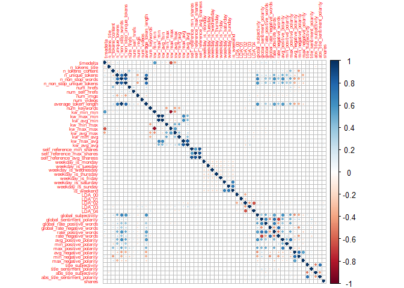
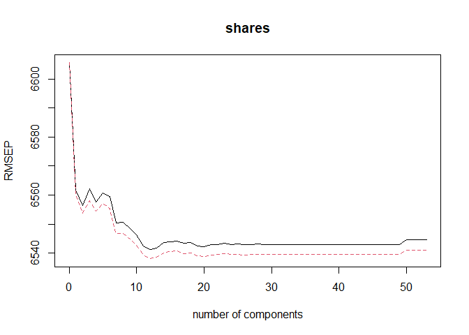
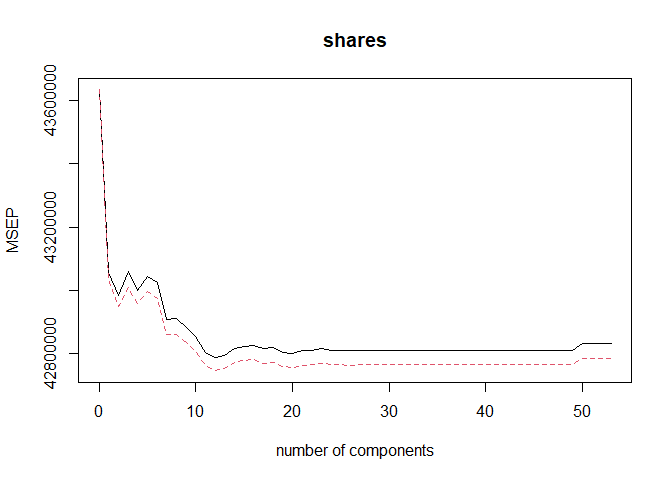
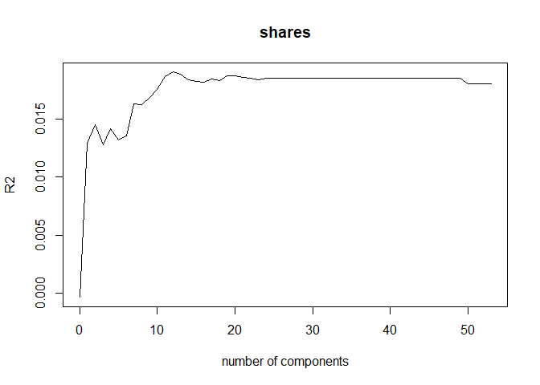
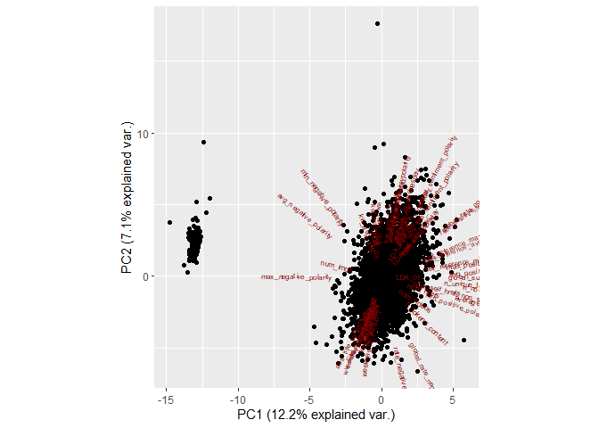
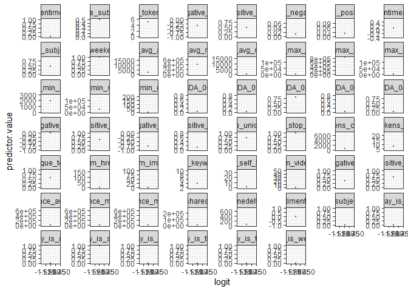
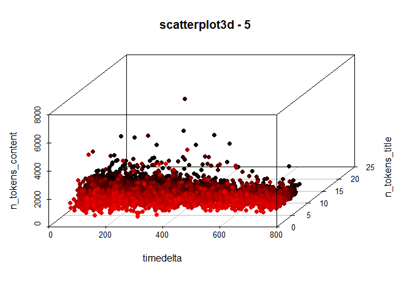

Project 2
================
Group 6, Xavier Genelin, Dave Bergeron
10/19/2021

I don’t think we need all of these libraries. We can keep them for now
but the project doesn’t require anything with SQL so those can be
removed later.

Dave: Agree, one of my bad habits not pruning the list from one
assignment to the other.

# Introduction

We’ll load in the (Online News Popularity Data
Set)\[<https://archive.ics.uci.edu/ml/datasets/Online+News+Popularity>\]
from the UCI Machine Learning Repository. From this data, we’ll break it
down into 6 different groups based on the data channel: lifestyle,
entertainment, bus, socmed, tech, and world.

# Load Data and Make Groups

``` r
news <- read_csv("OnlineNewsPopularity.csv")
```

    ## Rows: 39644 Columns: 61

    ## -- Column specification ------
    ## Delimiter: ","
    ## chr  (1): url
    ## dbl (60): timedelta, n_tok...

    ## 
    ## i Use `spec()` to retrieve the full column specification for this data.
    ## i Specify the column types or set `show_col_types = FALSE` to quiet this message.

``` r
# Remove the url column from the dataset
news <- news %>% select(!url)

# Subset data and remove the data_channel_is columns
## lifestyle
lifestyle <- news %>% filter(data_channel_is_lifestyle == 1) %>% select(!c(data_channel_is_bus, data_channel_is_entertainment, data_channel_is_lifestyle, data_channel_is_socmed, data_channel_is_tech, data_channel_is_world))

# entertainment
entertainment <- news %>% filter(data_channel_is_entertainment == 1) %>% select(!c(data_channel_is_bus, data_channel_is_entertainment, data_channel_is_lifestyle, data_channel_is_socmed, data_channel_is_tech, data_channel_is_world))

# bus
bus <- news %>% filter(data_channel_is_bus == 1) %>% select(!c(data_channel_is_bus, data_channel_is_entertainment, data_channel_is_lifestyle, data_channel_is_socmed, data_channel_is_tech, data_channel_is_world))

# socmed
socmed <- news %>% filter(data_channel_is_socmed == 1) %>% select(!c(data_channel_is_bus, data_channel_is_entertainment, data_channel_is_lifestyle, data_channel_is_socmed, data_channel_is_tech, data_channel_is_world))

# tech
tech <- news %>% filter(data_channel_is_tech == 1) %>% select(!c(data_channel_is_bus, data_channel_is_entertainment, data_channel_is_lifestyle, data_channel_is_socmed, data_channel_is_tech, data_channel_is_world))

# world
world <- news %>% filter(data_channel_is_world == 1) %>% select(!c(data_channel_is_bus, data_channel_is_entertainment, data_channel_is_lifestyle, data_channel_is_socmed, data_channel_is_tech, data_channel_is_world))
```

# Summarizations

``` r
# trying this with the world data set first.
set.seed(55)
trainIndex <- createDataPartition(world$shares, p = 0.7, list = FALSE)

# bus
busTrain <- bus[trainIndex, ]
busTest <- bus[-trainIndex, ]

# entertainment
entertainTrain <- entertainment[trainIndex, ]
entertainTest <- entertainment[-trainIndex, ]

# lifestyle 
lifestyleTrain <- lifestyle[trainIndex, ]
lifestyleTest <- lifestyle[-trainIndex, ]

# news 
newsTrain <- news[trainIndex, ]
newsTest <- news[-trainIndex, ]

# socmed 
socmedTrain <- socmed[trainIndex, ]
socmedTest <- socmed[-trainIndex, ]

# tech 
techTrain <- tech[trainIndex, ]
techTest <- tech[-trainIndex, ]

# world
worldTrain <- world[trainIndex, ]
worldTest <- world[-trainIndex, ]
```

I was hoping to see the correlation plot for the variables to see what
was most related to shares. Kind of rough with the large number of
variables

``` r
corrs <- cor(worldTrain)

corrplot(corrs, tl.cex = 0.5)
```

<!-- --> \# EDA
items

Let me know what your thoughts on all this and if it’s helpful, I did
this using the `worldTrain` dataset. Hoping this can influence the
number of predictors we can select for the candidate models. Assuming
I’m reading all this correctly, it looks like 24 of the 54 predictors
account for most of the variance in the dataset. Taking this and
coupling with the corrplot, I wonder if we can put a methodology in
place to help in variable selection.

## Principle Component Analysis (PCA)

Look at Proportion of Variance and Cumulative Proportion we can see the
amount of variation in each predictor and the cumulative variation.
Looking at PC28, we could say 90% of the variation is accounted from
with that number of predictors.

``` r
worldTrain.pca <- prcomp(worldTrain[,c(1:53)], center = TRUE, scale. = TRUE)
summary(worldTrain.pca)
```

    ## Importance of components:
    ##                           PC1
    ## Standard deviation     2.5392
    ## Proportion of Variance 0.1216
    ## Cumulative Proportion  0.1216
    ##                            PC2
    ## Standard deviation     1.94294
    ## Proportion of Variance 0.07123
    ## Cumulative Proportion  0.19288
    ##                            PC3
    ## Standard deviation     1.81167
    ## Proportion of Variance 0.06193
    ## Cumulative Proportion  0.25481
    ##                           PC4
    ## Standard deviation     1.7135
    ## Proportion of Variance 0.0554
    ## Cumulative Proportion  0.3102
    ##                           PC5
    ## Standard deviation     1.6296
    ## Proportion of Variance 0.0501
    ## Cumulative Proportion  0.3603
    ##                            PC6
    ## Standard deviation     1.56728
    ## Proportion of Variance 0.04635
    ## Cumulative Proportion  0.40665
    ##                            PC7
    ## Standard deviation     1.47358
    ## Proportion of Variance 0.04097
    ## Cumulative Proportion  0.44762
    ##                            PC8
    ## Standard deviation     1.43988
    ## Proportion of Variance 0.03912
    ## Cumulative Proportion  0.48674
    ##                            PC9
    ## Standard deviation     1.41682
    ## Proportion of Variance 0.03787
    ## Cumulative Proportion  0.52462
    ##                           PC10
    ## Standard deviation     1.29639
    ## Proportion of Variance 0.03171
    ## Cumulative Proportion  0.55633
    ##                           PC11
    ## Standard deviation     1.19912
    ## Proportion of Variance 0.02713
    ## Cumulative Proportion  0.58346
    ##                           PC12
    ## Standard deviation     1.16304
    ## Proportion of Variance 0.02552
    ## Cumulative Proportion  0.60898
    ##                          PC13
    ## Standard deviation     1.1135
    ## Proportion of Variance 0.0234
    ## Cumulative Proportion  0.6324
    ##                           PC14
    ## Standard deviation     1.11007
    ## Proportion of Variance 0.02325
    ## Cumulative Proportion  0.65562
    ##                           PC15
    ## Standard deviation     1.09709
    ## Proportion of Variance 0.02271
    ## Cumulative Proportion  0.67833
    ##                           PC16
    ## Standard deviation     1.07397
    ## Proportion of Variance 0.02176
    ## Cumulative Proportion  0.70010
    ##                           PC17
    ## Standard deviation     1.06349
    ## Proportion of Variance 0.02134
    ## Cumulative Proportion  0.72144
    ##                          PC18
    ## Standard deviation     1.0424
    ## Proportion of Variance 0.0205
    ## Cumulative Proportion  0.7419
    ##                           PC19
    ## Standard deviation     1.03879
    ## Proportion of Variance 0.02036
    ## Cumulative Proportion  0.76230
    ##                           PC20
    ## Standard deviation     1.02043
    ## Proportion of Variance 0.01965
    ## Cumulative Proportion  0.78195
    ##                           PC21
    ## Standard deviation     1.00846
    ## Proportion of Variance 0.01919
    ## Cumulative Proportion  0.80113
    ##                           PC22
    ## Standard deviation     0.97196
    ## Proportion of Variance 0.01782
    ## Cumulative Proportion  0.81896
    ##                           PC23
    ## Standard deviation     0.95456
    ## Proportion of Variance 0.01719
    ## Cumulative Proportion  0.83615
    ##                           PC24
    ## Standard deviation     0.92484
    ## Proportion of Variance 0.01614
    ## Cumulative Proportion  0.85229
    ##                           PC25
    ## Standard deviation     0.90202
    ## Proportion of Variance 0.01535
    ## Cumulative Proportion  0.86764
    ##                           PC26
    ## Standard deviation     0.82488
    ## Proportion of Variance 0.01284
    ## Cumulative Proportion  0.88048
    ##                           PC27
    ## Standard deviation     0.80679
    ## Proportion of Variance 0.01228
    ## Cumulative Proportion  0.89276
    ##                           PC28
    ## Standard deviation     0.76976
    ## Proportion of Variance 0.01118
    ## Cumulative Proportion  0.90394
    ##                           PC29
    ## Standard deviation     0.73219
    ## Proportion of Variance 0.01012
    ## Cumulative Proportion  0.91405
    ##                           PC30
    ## Standard deviation     0.72581
    ## Proportion of Variance 0.00994
    ## Cumulative Proportion  0.92399
    ##                           PC31
    ## Standard deviation     0.70322
    ## Proportion of Variance 0.00933
    ## Cumulative Proportion  0.93333
    ##                           PC32
    ## Standard deviation     0.69635
    ## Proportion of Variance 0.00915
    ## Cumulative Proportion  0.94247
    ##                           PC33
    ## Standard deviation     0.66002
    ## Proportion of Variance 0.00822
    ## Cumulative Proportion  0.95069
    ##                           PC34
    ## Standard deviation     0.64626
    ## Proportion of Variance 0.00788
    ## Cumulative Proportion  0.95857
    ##                           PC35
    ## Standard deviation     0.63956
    ## Proportion of Variance 0.00772
    ## Cumulative Proportion  0.96629
    ##                           PC36
    ## Standard deviation     0.56940
    ## Proportion of Variance 0.00612
    ## Cumulative Proportion  0.97241
    ##                           PC37
    ## Standard deviation     0.54604
    ## Proportion of Variance 0.00563
    ## Cumulative Proportion  0.97803
    ##                          PC38
    ## Standard deviation     0.4936
    ## Proportion of Variance 0.0046
    ## Cumulative Proportion  0.9826
    ##                           PC39
    ## Standard deviation     0.44843
    ## Proportion of Variance 0.00379
    ## Cumulative Proportion  0.98643
    ##                           PC40
    ## Standard deviation     0.40303
    ## Proportion of Variance 0.00306
    ## Cumulative Proportion  0.98949
    ##                           PC41
    ## Standard deviation     0.34617
    ## Proportion of Variance 0.00226
    ## Cumulative Proportion  0.99175
    ##                          PC42
    ## Standard deviation     0.3412
    ## Proportion of Variance 0.0022
    ## Cumulative Proportion  0.9940
    ##                           PC43
    ## Standard deviation     0.27517
    ## Proportion of Variance 0.00143
    ## Cumulative Proportion  0.99538
    ##                           PC44
    ## Standard deviation     0.26981
    ## Proportion of Variance 0.00137
    ## Cumulative Proportion  0.99675
    ##                           PC45
    ## Standard deviation     0.23567
    ## Proportion of Variance 0.00105
    ## Cumulative Proportion  0.99780
    ##                           PC46
    ## Standard deviation     0.19887
    ## Proportion of Variance 0.00075
    ## Cumulative Proportion  0.99854
    ##                           PC47
    ## Standard deviation     0.17000
    ## Proportion of Variance 0.00055
    ## Cumulative Proportion  0.99909
    ##                           PC48
    ## Standard deviation     0.16723
    ## Proportion of Variance 0.00053
    ## Cumulative Proportion  0.99962
    ##                           PC49
    ## Standard deviation     0.14261
    ## Proportion of Variance 0.00038
    ## Cumulative Proportion  1.00000
    ##                             PC50
    ## Standard deviation     5.528e-09
    ## Proportion of Variance 0.000e+00
    ## Cumulative Proportion  1.000e+00
    ##                             PC51
    ## Standard deviation     1.225e-12
    ## Proportion of Variance 0.000e+00
    ## Cumulative Proportion  1.000e+00
    ##                             PC52
    ## Standard deviation     2.429e-15
    ## Proportion of Variance 0.000e+00
    ## Cumulative Proportion  1.000e+00
    ##                             PC53
    ## Standard deviation     1.297e-15
    ## Proportion of Variance 0.000e+00
    ## Cumulative Proportion  1.000e+00

## Partial Least Squares (PLS) Analysis

Similar to the PCA, what I’m seeing here, is that if we were to make a
threshold determination, say we want 75% of the variance to be
explained, then we could say we’re looking to have about 26 predictors
in the model. The PLS plot below visualizes the numbers we’re seeing as
well. Look furthering at the charts, perhaps 11 would be optimal?

``` r
plswTmodel <- plsr(shares ~., data=worldTrain, scale=TRUE, validation="CV")
summary(plswTmodel)
```

    ## Data:    X dimension: 5900 53 
    ##  Y dimension: 5900 1
    ## Fit method: kernelpls
    ## Number of components considered: 53
    ## 
    ## VALIDATION: RMSEP
    ## Cross-validated using 10 random segments.
    ##        (Intercept)  1 comps
    ## CV            6606     6562
    ## adjCV         6606     6560
    ##        2 comps  3 comps
    ## CV        6556     6562
    ## adjCV     6554     6558
    ##        4 comps  5 comps
    ## CV        6557     6561
    ## adjCV     6554     6557
    ##        6 comps  7 comps
    ## CV        6559     6550
    ## adjCV     6555     6547
    ##        8 comps  9 comps
    ## CV        6551     6549
    ## adjCV     6547     6545
    ##        10 comps  11 comps
    ## CV         6546      6543
    ## adjCV      6543      6539
    ##        12 comps  13 comps
    ## CV         6541      6542
    ## adjCV      6538      6539
    ##        14 comps  15 comps
    ## CV         6544      6544
    ## adjCV      6540      6540
    ##        16 comps  17 comps
    ## CV         6544      6543
    ## adjCV      6541      6540
    ##        18 comps  19 comps
    ## CV         6544      6542
    ## adjCV      6540      6539
    ##        20 comps  21 comps
    ## CV         6542      6543
    ## adjCV      6539      6539
    ##        22 comps  23 comps
    ## CV         6543      6543
    ## adjCV      6540      6540
    ##        24 comps  25 comps
    ## CV         6543      6543
    ## adjCV      6539      6540
    ##        26 comps  27 comps
    ## CV         6543      6543
    ## adjCV      6539      6539
    ##        28 comps  29 comps
    ## CV         6543      6543
    ## adjCV      6540      6539
    ##        30 comps  31 comps
    ## CV         6543      6543
    ## adjCV      6540      6540
    ##        32 comps  33 comps
    ## CV         6543      6543
    ## adjCV      6540      6539
    ##        34 comps  35 comps
    ## CV         6543      6543
    ## adjCV      6540      6540
    ##        36 comps  37 comps
    ## CV         6543      6543
    ## adjCV      6539      6539
    ##        38 comps  39 comps
    ## CV         6543      6543
    ## adjCV      6540      6540
    ##        40 comps  41 comps
    ## CV         6543      6543
    ## adjCV      6539      6539
    ##        42 comps  43 comps
    ## CV         6543      6543
    ## adjCV      6539      6539
    ##        44 comps  45 comps
    ## CV         6543      6543
    ## adjCV      6539      6539
    ##        46 comps  47 comps
    ## CV         6543      6543
    ## adjCV      6539      6539
    ##        48 comps  49 comps
    ## CV         6543      6543
    ## adjCV      6539      6539
    ##        50 comps  51 comps
    ## CV         6545      6545
    ## adjCV      6541      6541
    ##        52 comps  53 comps
    ## CV         6545      6545
    ## adjCV      6541      6541
    ## 
    ## TRAINING: % variance explained
    ##         1 comps  2 comps
    ## X         5.669    9.797
    ## shares    2.279    2.841
    ##         3 comps  4 comps
    ## X        16.063   23.676
    ## shares    3.029    3.165
    ##         5 comps  6 comps
    ## X        29.141   32.186
    ## shares    3.274    3.404
    ##         7 comps  8 comps
    ## X         34.84   37.041
    ## shares     3.53    3.632
    ##         9 comps  10 comps
    ## X        40.306    42.960
    ## shares    3.669     3.707
    ##         11 comps  12 comps
    ## X         46.146    48.454
    ## shares     3.743     3.775
    ##         13 comps  14 comps
    ## X         51.981    54.404
    ## shares     3.783     3.793
    ##         15 comps  16 comps
    ## X         57.083    59.377
    ## shares     3.802     3.809
    ##         17 comps  18 comps
    ## X         60.783    62.566
    ## shares     3.815     3.817
    ##         19 comps  20 comps
    ## X         65.065    67.018
    ## shares     3.818     3.819
    ##         21 comps  22 comps
    ## X          68.34    70.064
    ## shares      3.82     3.821
    ##         23 comps  24 comps
    ## X         71.385    72.738
    ## shares     3.821     3.822
    ##         25 comps  26 comps
    ## X         73.953    75.127
    ## shares     3.822     3.822
    ##         27 comps  28 comps
    ## X         76.078    77.230
    ## shares     3.822     3.822
    ##         29 comps  30 comps
    ## X         78.543    79.573
    ## shares     3.822     3.822
    ##         31 comps  32 comps
    ## X         80.773    81.912
    ## shares     3.822     3.822
    ##         33 comps  34 comps
    ## X         83.036    84.291
    ## shares     3.822     3.822
    ##         35 comps  36 comps
    ## X         85.802    86.548
    ## shares     3.822     3.822
    ##         37 comps  38 comps
    ## X         87.257    88.835
    ## shares     3.822     3.822
    ##         39 comps  40 comps
    ## X         89.983    91.383
    ## shares     3.822     3.822
    ##         41 comps  42 comps
    ## X         92.525    93.560
    ## shares     3.822     3.822
    ##         43 comps  44 comps
    ## X         95.038    95.736
    ## shares     3.822     3.822
    ##         45 comps  46 comps
    ## X         96.967    98.130
    ## shares     3.822     3.822
    ##         47 comps  48 comps
    ## X         98.464    99.020
    ## shares     3.822     3.822
    ##         49 comps  50 comps
    ## X        100.000   100.000
    ## shares     3.822     3.827
    ##         51 comps  52 comps
    ## X        100.000   100.000
    ## shares     3.827     3.827
    ##         53 comps
    ## X        100.000
    ## shares     3.827

## PLS Plot

Visualizing the data above, the plots suggest there are diminishing
marginal returns from going beyond 11 predictors or so. Looking at the
R2, chart, is that suggesting based on the data the best R2 we can get
is .02?

``` r
validationplot(plswTmodel)
```

<!-- -->

``` r
validationplot(plswTmodel, val.type="MSEP")
```

<!-- -->

``` r
validationplot(plswTmodel, val.type="R2")
```

<!-- -->

## BI Plot

Curious what data is segmented from the main group.

``` r
worldbiplot <- ggbiplot(worldTrain.pca, scale. = TRUE, var.scale = TRUE, obs.scale = TRUE, varname.size = 2, varname.adjust = 2)
worldbiplot
```

<!-- -->

## Multicollinearity Assessment

A multicollinearity assessment was conducted to see if good predictors
could also be selected based on this analysis. Based on some guidance I
found on-line, as a rule of thumb, a VIF value that exceeds 5 or 10
indicates a problematic amount of collinearity.

Of note, four predictors were removed as they had perfect collinearity.

-   `weekday_is_sunday`
-   `is_weekend`
-   `LDA_04`
-   `rate_negative_words`

Based on the results below, 31 predictors fall below 5.

``` r
WorldtrainFit1 <- lm(shares ~ timedelta + n_tokens_title + n_tokens_content + n_unique_tokens + 
    n_non_stop_words + n_non_stop_unique_tokens + num_hrefs + 
    num_self_hrefs + num_imgs + num_videos + average_token_length + 
    num_keywords + kw_min_min + kw_max_min + kw_avg_min + kw_min_max + 
    kw_max_max + kw_avg_max + kw_min_avg + kw_max_avg + kw_avg_avg + 
    self_reference_min_shares + self_reference_max_shares + self_reference_avg_sharess + 
    weekday_is_monday + weekday_is_tuesday + weekday_is_wednesday + 
    weekday_is_thursday + weekday_is_friday + weekday_is_saturday + LDA_00 + LDA_01 + LDA_02 + 
    LDA_03 + global_subjectivity + global_sentiment_polarity + 
    global_rate_positive_words + global_rate_negative_words + 
    rate_positive_words + avg_positive_polarity + 
    min_positive_polarity + max_positive_polarity + avg_negative_polarity + 
    min_negative_polarity + max_negative_polarity + title_subjectivity + 
    title_sentiment_polarity + abs_title_subjectivity + abs_title_sentiment_polarity, data = worldTrain)
car::vif(WorldtrainFit1)
```

    ##                    timedelta 
    ##                     2.062281 
    ##               n_tokens_title 
    ##                     1.128119 
    ##             n_tokens_content 
    ##                     3.178254 
    ##              n_unique_tokens 
    ##                    22.602556 
    ##             n_non_stop_words 
    ##                    29.738825 
    ##     n_non_stop_unique_tokens 
    ##                    22.660074 
    ##                    num_hrefs 
    ##                     1.461584 
    ##               num_self_hrefs 
    ##                     1.221517 
    ##                     num_imgs 
    ##                     1.397207 
    ##                   num_videos 
    ##                     1.091875 
    ##         average_token_length 
    ##                    17.249426 
    ##                 num_keywords 
    ##                     1.600270 
    ##                   kw_min_min 
    ##                     4.085505 
    ##                   kw_max_min 
    ##                    17.061694 
    ##                   kw_avg_min 
    ##                    16.534917 
    ##                   kw_min_max 
    ##                     1.672174 
    ##                   kw_max_max 
    ##                     5.263357 
    ##                   kw_avg_max 
    ##                     2.801744 
    ##                   kw_min_avg 
    ##                     2.357512 
    ##                   kw_max_avg 
    ##                     7.191672 
    ##                   kw_avg_avg 
    ##                     7.834453 
    ##    self_reference_min_shares 
    ##                     8.378571 
    ##    self_reference_max_shares 
    ##                     8.031901 
    ##   self_reference_avg_sharess 
    ##                    21.771775 
    ##            weekday_is_monday 
    ##                     2.938842 
    ##           weekday_is_tuesday 
    ##                     3.174650 
    ##         weekday_is_wednesday 
    ##                     3.200225 
    ##          weekday_is_thursday 
    ##                     3.179367 
    ##            weekday_is_friday 
    ##                     2.890727 
    ##          weekday_is_saturday 
    ##                     1.841520 
    ##                       LDA_00 
    ##                     1.276095 
    ##                       LDA_01 
    ##                     1.174545 
    ##                       LDA_02 
    ##                     1.883109 
    ##                       LDA_03 
    ##                     1.609372 
    ##          global_subjectivity 
    ##                     2.872123 
    ##    global_sentiment_polarity 
    ##                     9.250418 
    ##   global_rate_positive_words 
    ##                     5.922295 
    ##   global_rate_negative_words 
    ##                     6.956681 
    ##          rate_positive_words 
    ##                    15.658674 
    ##        avg_positive_polarity 
    ##                     5.795009 
    ##        min_positive_polarity 
    ##                     1.831673 
    ##        max_positive_polarity 
    ##                     3.133388 
    ##        avg_negative_polarity 
    ##                     5.905792 
    ##        min_negative_polarity 
    ##                     4.213842 
    ##        max_negative_polarity 
    ##                     2.278010 
    ##           title_subjectivity 
    ##                     2.535236 
    ##     title_sentiment_polarity 
    ##                     1.153746 
    ##       abs_title_subjectivity 
    ##                     1.456135 
    ## abs_title_sentiment_polarity 
    ##                     2.254761

## Linearity Assessment

Full disclosure, I came across this doing research for homework 7.

(<http://www.sthda.com/english/articles/36-classification-methods-essentials/148-logistic-regression-assumptions-and-diagnostics-in-r/>)

It provided some helpful insights when the response variable is binary,
and I’m not sure if it will be a value add for this project. That being
said maybe this helps with variable selection. I’m also not 100% sure
I’m interpreting the results correctly, but if the point is at the top
of the chart, would that suggest the variable is a good predictor of the
response? It led me to select 11 predictors with the highest values on
the charts.

``` r
# Fit the logistic regression model
WorldtrainFit2 <- glm(shares ~ ., data = worldTrain, family = gaussian())

# Predict the probability (p) of quality
probabilities <- predict(WorldtrainFit2, type = "response")

# Select only numeric predictors
worldTrain2 <- worldTrain %>%
  dplyr::select_if(is.numeric) 
predictors <- colnames(worldTrain2)

# Bind the logit and tidying the data for plot
worldTrain2 <- worldTrain2 %>%
  mutate(logit = log(probabilities/(1-probabilities))) %>%
  gather(key = "predictors", value = "predictor.value", -logit)
```

    ## Warning in log(probabilities/
    ## (1 - probabilities)): NaNs
    ## produced

``` r
#create scatter plots
ggplot(worldTrain2, aes(logit, predictor.value))+
  geom_point(size = 0.5, alpha = 0.5) +
  geom_smooth(method = "loess") + 
  theme_bw() + 
  facet_wrap(~predictors, scales = "free_y")
```

    ## `geom_smooth()` using formula 'y ~ x'

    ## Warning: Removed 318546 rows
    ## containing non-finite
    ## values (stat_smooth).

    ## Warning: Removed 318546 rows
    ## containing missing values
    ## (geom_point).

<!-- -->

## Trying to see if there is another visualization that can assist with variable selection.

Still playing around with this, seeing if there if there is any
assistance selecting variables.

``` r
s3d <- scatterplot3d(worldTrain, type="p", highlight.3d=TRUE,
                     angle=55, scale.y=0.7, pch=16, main="scatterplot3d - 5")
```

<!-- -->

# Modeling

In this section we’re going to compare the following models: random
forest, linear regression, and two ensemble models (we can fill this in
when we decide which two to do). Each of the models will be trying to
predict the amount of shares for each of the data channels.

## Dave’s Attempt at Linear Models

I played around with a few models based on the EDA information above.
Looking at the PLS plot, I assume .02 is the best R2 we can get with the
data? The four models below go in order from most to least amount of
predictors. I’m sure their is room for improvement here.

``` r
#Model 1 - all predictors
worldtrainlmfit1 <- lm(shares ~ ., data = worldTrain)

#Model 2 - selecting predictors from the Multicolinearity analysis - 31 predictors
worldtrainlmfit2 <- lm(shares ~ timedelta + n_tokens_title + n_tokens_content + num_hrefs + num_self_hrefs +  num_imgs + num_videos + num_keywords + kw_min_min + kw_min_max + kw_avg_max + kw_min_avg + weekday_is_monday + weekday_is_tuesday + weekday_is_wednesday + weekday_is_thursday + weekday_is_friday + weekday_is_saturday + LDA_00 + LDA_01 + LDA_02 + LDA_03 + global_subjectivity + min_positive_polarity + max_positive_polarity + min_negative_polarity +  max_negative_polarity + title_subjectivity + title_sentiment_polarity + abs_title_subjectivity + abs_title_sentiment_polarity ,data = worldTrain)

#Model 3 -  Selecting predictors from Linearity Assessment - 11 predictors
worldtrainlmfit3 <- lm(shares ~ title_subjectivity + average_token_length + max_negative_polarity + is_weekend + kw_max_max + kw_min_avg + LDA_02 + min_negative_polarity + n_non_stop_unique_tokens + n_non_stop_words + global_rate_positive_words, data = worldTrain)

#Model 4 -  Selecting predictors based on relevancy from ANOVA results after running the summary of the worldtrainlmfit0 model with all predictors - 4 predictors
worldtrainglmfit4 <- lm(shares ~  num_imgs + kw_min_avg + kw_max_avg + kw_avg_avg, data = worldTrain)
```

### LM Results

I’m still in disbelief the adj-R2 is this low, but if the R2 in the PLS
visualization is right, and .02 is the best we can aim for, then I guess
it is what is. So based on that model 3 or 4 would be good given the
lower complexity.

``` r
compareFitStats <- function(worldtrainlmfit1, worldtrainlmfit2, worldtrainlmfit3, worldtrainlmfit4){
    require(MuMIn)
    fitStats <- data.frame(fitStat = c("Adj R Square", "AIC", "AICc", "BIC"),
        col1 = round(c(summary(worldtrainlmfit1)$adj.r.squared, AIC(worldtrainlmfit1), 
                                    MuMIn::AICc(worldtrainlmfit1), BIC(worldtrainlmfit1)), 3),
            col2 = round(c(summary(worldtrainlmfit2)$adj.r.squared, AIC(worldtrainlmfit2), 
                                    MuMIn::AICc(worldtrainlmfit2), BIC(worldtrainlmfit2)), 3),
        col3 = round(c(summary(worldtrainlmfit3)$adj.r.squared, AIC(worldtrainlmfit3), 
                                    MuMIn::AICc(worldtrainlmfit3), BIC(worldtrainlmfit3)), 3),
      col4 = round(c(summary(worldtrainlmfit4)$adj.r.squared, AIC(worldtrainlmfit4), 
                                    MuMIn::AICc(worldtrainlmfit4), BIC(worldtrainlmfit4)), 3))
    #put names on returned df
    calls <- as.list(match.call())
    calls[[1]] <- NULL
    names(fitStats)[2:5] <- unlist(calls)
    fitStats
}

compareFitStats(worldtrainlmfit1, worldtrainlmfit2, worldtrainlmfit3, worldtrainglmfit4)
```

    ##        fitStat
    ## 1 Adj R Square
    ## 2          AIC
    ## 3         AICc
    ## 4          BIC
    ##   worldtrainlmfit1
    ## 1             0.03
    ## 2        120402.41
    ## 3        120403.32
    ## 4        120743.23
    ##   worldtrainlmfit2
    ## 1            0.019
    ## 2       120451.336
    ## 3       120451.719
    ## 4       120671.866
    ##   worldtrainlmfit3
    ## 1            0.017
    ## 2       120444.351
    ## 3       120444.412
    ## 4       120531.226
    ##   worldtrainglmfit4
    ## 1             0.016
    ## 2        120444.832
    ## 3        120444.846
    ## 4        120484.928

#### Running models through Cross validation

Running models through CV. The all predictor model has the highest R2,
but the 11 and 4 predictors are similar and much less complex.

``` r
#all predictors
fit1 <- train(shares ~ ., data = worldTrain, method = "lm", 
         preProcess = c("center", "scale"),
         trControl = trainControl(method = "cv", number = 10))
```

    ## Warning in
    ## predict.lm(modelFit,
    ## newdata): prediction from
    ## a rank-deficient fit may be
    ## misleading

    ## Warning in
    ## predict.lm(modelFit,
    ## newdata): prediction from
    ## a rank-deficient fit may be
    ## misleading

    ## Warning in
    ## predict.lm(modelFit,
    ## newdata): prediction from
    ## a rank-deficient fit may be
    ## misleading

    ## Warning in
    ## predict.lm(modelFit,
    ## newdata): prediction from
    ## a rank-deficient fit may be
    ## misleading

    ## Warning in
    ## predict.lm(modelFit,
    ## newdata): prediction from
    ## a rank-deficient fit may be
    ## misleading

    ## Warning in
    ## predict.lm(modelFit,
    ## newdata): prediction from
    ## a rank-deficient fit may be
    ## misleading

    ## Warning in
    ## predict.lm(modelFit,
    ## newdata): prediction from
    ## a rank-deficient fit may be
    ## misleading

    ## Warning in
    ## predict.lm(modelFit,
    ## newdata): prediction from
    ## a rank-deficient fit may be
    ## misleading

    ## Warning in
    ## predict.lm(modelFit,
    ## newdata): prediction from
    ## a rank-deficient fit may be
    ## misleading

    ## Warning in
    ## predict.lm(modelFit,
    ## newdata): prediction from
    ## a rank-deficient fit may be
    ## misleading

``` r
#31 predictors
fit2 <- train(shares ~ timedelta + n_tokens_title + n_tokens_content + num_hrefs + num_self_hrefs +  num_imgs + num_videos + num_keywords + kw_min_min + kw_min_max + kw_avg_max + kw_min_avg + weekday_is_monday + weekday_is_tuesday + weekday_is_wednesday + weekday_is_thursday + weekday_is_friday + weekday_is_saturday + LDA_00 + LDA_01 + LDA_02 + LDA_03 + global_subjectivity + min_positive_polarity + max_positive_polarity + min_negative_polarity +  max_negative_polarity + title_subjectivity + title_sentiment_polarity + abs_title_subjectivity + abs_title_sentiment_polarity , data = worldTrain, method = "lm", 
         preProcess = c("center", "scale"),
         trControl = trainControl(method = "cv", number = 10))

#11 predictors
fit3 <- train(shares ~ title_subjectivity + average_token_length + max_negative_polarity + is_weekend + kw_max_max + kw_min_avg + LDA_02 + min_negative_polarity + n_non_stop_unique_tokens + n_non_stop_words + global_rate_positive_words, data = worldTrain, method = "lm", 
         preProcess = c("center", "scale"),
         trControl = trainControl(method = "cv", number = 10))

#4 predictors
fit4 <- train(shares ~ num_imgs + kw_min_avg + kw_max_avg + kw_avg_avg, data = worldTrain, method = "lm", 
         preProcess = c("center", "scale"),
         trControl = trainControl(method = "cv", number = 10))

fit1
```

    ## Linear Regression 
    ## 
    ## 5900 samples
    ##   53 predictor
    ## 
    ## Pre-processing:
    ##  centered (53), scaled (53) 
    ## Resampling: Cross-Validated (10 fold) 
    ## Summary of sample sizes: 5309, 5310, 5311, 5310, 5310, 5309, ... 
    ## Resampling results:
    ## 
    ##   RMSE      Rsquared 
    ##   6005.922  0.0285787
    ##   MAE     
    ##   2034.246
    ## 
    ## Tuning parameter
    ##  held constant at a value
    ##  of TRUE

``` r
fit2
```

    ## Linear Regression 
    ## 
    ## 5900 samples
    ##   31 predictor
    ## 
    ## Pre-processing:
    ##  centered (31), scaled (31) 
    ## Resampling: Cross-Validated (10 fold) 
    ## Summary of sample sizes: 5310, 5309, 5310, 5310, 5311, 5310, ... 
    ## Resampling results:
    ## 
    ##   RMSE      Rsquared  
    ##   5906.167  0.01983723
    ##   MAE    
    ##   1990.08
    ## 
    ## Tuning parameter
    ##  held constant at a value
    ##  of TRUE

``` r
fit3
```

    ## Linear Regression 
    ## 
    ## 5900 samples
    ##   11 predictor
    ## 
    ## Pre-processing:
    ##  centered (11), scaled (11) 
    ## Resampling: Cross-Validated (10 fold) 
    ## Summary of sample sizes: 5311, 5308, 5310, 5310, 5310, 5310, ... 
    ## Resampling results:
    ## 
    ##   RMSE      Rsquared  
    ##   5994.033  0.02003624
    ##   MAE     
    ##   1981.811
    ## 
    ## Tuning parameter
    ##  held constant at a value
    ##  of TRUE

``` r
fit4
```

    ## Linear Regression 
    ## 
    ## 5900 samples
    ##    4 predictor
    ## 
    ## Pre-processing: centered
    ##  (4), scaled (4) 
    ## Resampling: Cross-Validated (10 fold) 
    ## Summary of sample sizes: 5311, 5308, 5309, 5311, 5309, 5310, ... 
    ## Resampling results:
    ## 
    ##   RMSE      Rsquared  
    ##   6136.009  0.01974806
    ##   MAE     
    ##   1968.072
    ## 
    ## Tuning parameter
    ##  held constant at a value
    ##  of TRUE

## Random Forest

Tried to use all the variables, took forever to run. Initially had 10 cv
and 1:15 trees. Made the cv to 5 and tried smaller mtry values but it
still takes a long time.

``` r
set.seed(55)
# takes forever to run
# rfFit <- train(shares ~ ., data = worldTrain, method = "rf", trControl = trainControl(method = "cv", number = 5), tuneGrid = expand.grid(mtry = 1:8))
```

## Linear Regression

## Ensemble

# Comparison

## Test for project 2

Test
